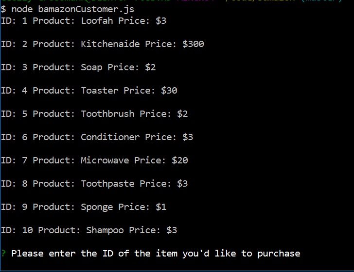
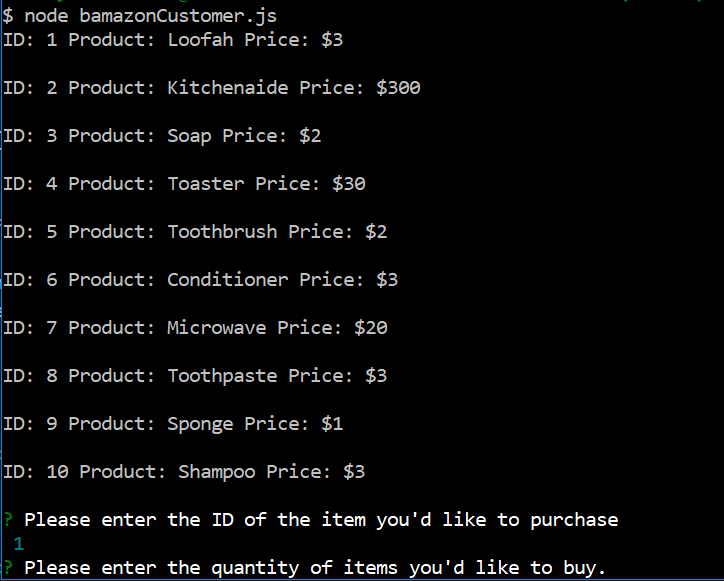
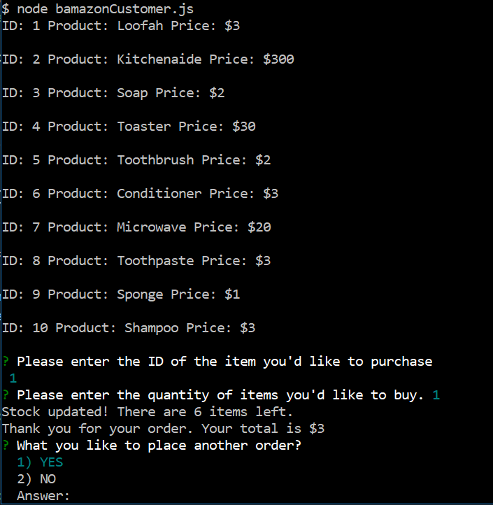
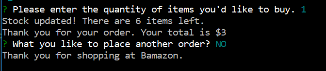
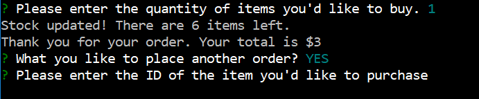
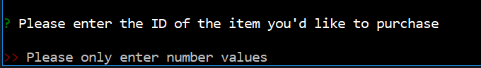

# bamazon
## An Amazon style application for placing product orders through the command line.

## Initial Table Display
#### User can choose items for a bathroom or kitchen by selecting the item ID and how many items they'd like to purchase.

## User selects which item to purchase
#### Choose by entering a number value for the item ID and number quantity when prompted.

## User is shown total stock remaining and price per order

#### If user chooses no, the user is thanked for their purchase and connection ends.

#### If user chooses yes, table is shown again and user can make a new selection.

#### If user enters a letter input instead of number, app notifies user of invalid input and asks for new ID.

